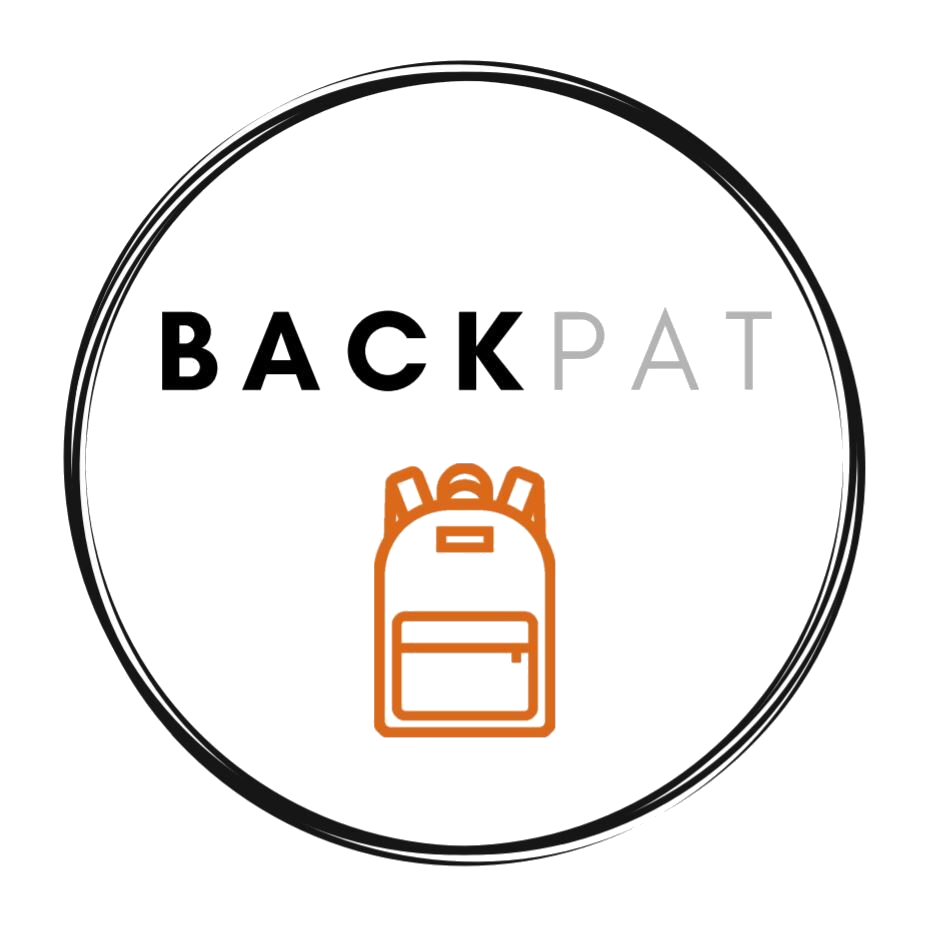

## Andrea's Portfolio

---

### Independent Projects

[Red Riding Hood App (TechPointX SOS Challenge Winning Submission)](/red_riding_hood)

---
[Backpat Volunteer Tutoring](/backpat)

---
[Project 3 Title](http://example.com/)

---

### Certifications and Awards

- [TechPointX SOS Challenge 2020 Winning Submission: Red Riding Hood](https://devpost.com/software/red-riding-hood-2i47k3)
- [Kaggle Intermediate Machine Learning Certification](https://www.kaggle.com/learn/certification/andreawynn/intermediate-machine-learning)
- [Kaggle Introductory Machine Learning Certification](https://www.kaggle.com/learn/certification/andreawynn/intro-to-machine-learning)
- [Kaggle Python Certification](https://www.kaggle.com/learn/certification/andreawynn/python)
- [HackerRank Java Certification](https://www.hackerrank.com/certificates/8e67b1460247)
- [TutorMe Certified Tutor Profile](https://tutorme.com/tutors/264453/)

